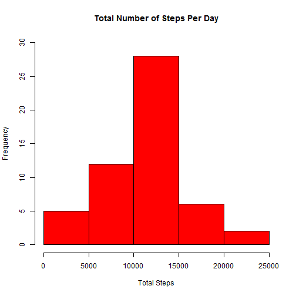

&nbsp;


##Loading an preprocessing the data

```r
## Load all required libraries 
library(dplyr)
library(data.table)
library(lattice)

## Read the data from the activity.csv file
actDataFrame <- read.csv("activity.csv", stringsAsFactors = FALSE)

## Convert data frame to data table which offers much better performance
actDataTable <- data.table(actDataFrame)
```
&nbsp;


##What is the mean total number of steps taken per day?

```r
## Remove all records with the NA values
actDataTableClean <- na.omit(actDataTable)

## Calculate the total number of steps taken per day without the NA values
totalStepsPerDay <- summarize(group_by(actDataTableClean, date), total_steps = sum(steps))

## Create a historgram with total steps per day
with(totalStepsPerDay, hist(total_steps,
                            main = "Total Steps Per Day",
                            xlab = "Total Steps",
                            ylab = "Frequency",
                            col = "Red",
                            ylim = c(0,30)))
```

 

```r
## Calculate the mean of the total number of steps per day
meanTotalStepsPerDay <- round(with(totalStepsPerDay, mean(total_steps)))

## Calculate the median of the total number of steps per day
medianTotalStepsPerDay <- round(with(totalStepsPerDay, median(total_steps)))
```
The mean of the total number of steps taken per day is 10766.  
The median of the total number of steps taken per day is 10765.  
&nbsp;


##What is the average daily activity pattern

```r
## Calculate the average number of steps taken per 5-minute interval without 
## the NA values
avgStepsPerInterval <- summarize(group_by(actDataTableClean, interval), 
                                          avg_steps = mean(steps))

## Create a time series plot of the 5-minute interval (x-axis) and the average
## number of steps taken, averaged across all days (y-axis)
with(avgStepsPerInterval, plot(interval, avg_steps, 
                               type = "l",
                               main = "Average Steps per 5-Minute Interval",
                               xlab = "5-Minute Interval",
                               ylab = "Average Steps"))
     
## Set the x-axis coordinates to the range (0, 2355)
axis(1, xaxp = c(0, 2355, 1), las = 1)
```

 

```r
## Calculate a 5-minute interval which contains the maximum number of steps
## on average across all the days in the dataset
maxInterval <- avgStepsPerInterval[avg_steps == max(avgStepsPerInterval$avg_steps), interval]
```
The 835 interval contains the maximum number of steps on average 
across all the days in the dataset.  
&nbsp;


##Imputing missing values

```r
## Calculate the total number of missing values in the dataset
totalNumberMissingValues <- count(filter(actDataTable, is.na(steps)))

##  Create a new dataset with all of the missing values in the original dataset
## filled in with the mean for that 5-minute interval
actDataTableNew <- actDataTable
actDataTableNew$steps[is.na(actDataTableNew$steps)] <- 
        avgStepsPerInterval[interval == actDataTableNew[is.na(steps), interval], avg_steps]

## Calculate the total number of steps taken per day
totalStepsPerDay <- summarize(group_by(actDataTableNew, date), total_steps = sum(steps))

## Create a historgram with total steps per day
with(totalStepsPerDay, hist(total_steps,
                            main = "Total Steps Per Day",
                            xlab = "Total Steps",
                            ylab = "Frequency",
                            col = "Red",
                            ylim = c(0,30)))
```

 

```r
## Calculate the mean of the total number of steps per day
meanTotalStepsPerDay <- with(totalStepsPerDay, mean(total_steps))

## Calculate the median of the total number of steps per day
medianTotalStepPerDay <- with(totalStepsPerDay, median(total_steps))
```
The total number of missing values in the dataset is 2304.  
The mean of the total number of steps taken per day is 10766.  
The median of the total number of steps taken per day is 10765.  
&nbsp;


##Are there differences in activity patterns between weekdays and weekends?

```r
## Create a new factor variable with two levels - "weekday" and "weekend" 
## indicating whether a given date is a weekday or weekend day
actDataTableNew <- actDataTableNew %>% mutate(day = 0)
for (i in actDataTableNew$date) {
       
        if (weekdays(as.Date(i)) %in% c("Saturday", "Sunday")) {
              
            actDataTableNew$day[actDataTableNew$date == i] <- 1 }
}
actDataTableNew$day <- as.factor(actDataTableNew$day)
levels(actDataTableNew$day) <- c("weekday", "weekend")

## Calculate the average number of steps taken per 5-minute interval 
avgStepsPerInterval <- summarize(group_by(actDataTableNew, interval, day), 
                                 avg_steps = mean(steps))

## Create a time series plot of the 5-minute interval (x-axis) and the average 
## number of steps taken, averaged across all weekday days or weekend days (y-axis)
with(avgStepsPerInterval, xyplot(avg_steps ~ interval | day, 
                               type = "l",
                               main = "Average Steps per 5-Minute Interval",
                               xlab = "5-Minute Interval",
                               ylab = "Average Steps"))
```

 
